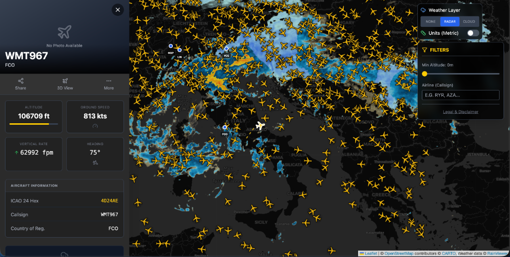
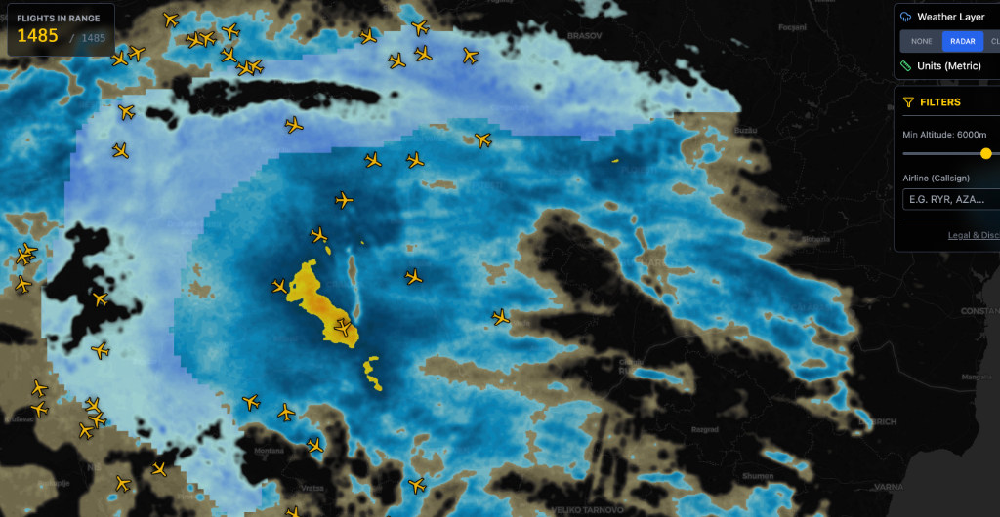

# ✈️ Flight Tracker Pro


<p align="center">
  
  
</p>


A modern, real-time flight tracking application built with passion. Visualize air traffic, weather conditions, and aircraft details in a beautiful, responsive interface.

## 🛠️ Tech Stack

### Frontend


### Backend


### APIs & Services


## ✨ key Features

-   **Real-Time Tracking**: Watch aircraft move in real-time across the map.
-   **Live Weather**: Animated Radar and Satellite layers to see clouds and precipitation.
-   **Accurate Details**: Click on any flight to see the *actual* aircraft photo and detailed schedule.
-   **Cockpit View**: Simulated view from the aircraft's perspective.
-   **Filters**: Filter by altitude or airline to find exactly what you're looking for.

## � Getting Started

### Prerequisites
-   Docker & Docker Compose
-   Node.js 20+ (for local frontend dev)
-   Python 3.10+ (for local backend dev)

### Quick Start (Docker)
The easiest way to run the full stack:

```bash
docker-compose up -d --build
```

Access the app at `http://localhost:5173`.

### Local Development

**Backend**
```bash
cd backend
python -m venv venv
source venv/bin/activate
pip install -r requirements.txt
uvicorn main:app --reload --host 0.0.0.0 --port 8000
```

**Frontend**
```bash
cd frontend
npm install
npm run dev
```

## 🤝 Contributing

Contributions are what make the open source community such an amazing place to learn, inspire, and create. Any contributions you make are **greatly appreciated**.

1.  **Fork** the Project
2.  Create your Feature Branch (`git checkout -b feature/AmazingFeature`)
3.  **Commit** your Changes (`git commit -m 'Add some AmazingFeature'`)
4.  **Push** to the Branch (`git push origin feature/AmazingFeature`)
5.  Open a **Pull Request**

## ⚠️ Disclaimer
This project is for **educational purposes only**. It uses unofficial APIs which may change or be restricted at any time. Do not use for safety-critical applications.

---
Made with ❤️ by [Umberto Casa](https://github.com/umbertocasa-hub)
